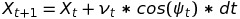
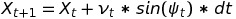
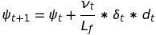
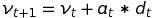
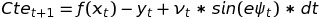
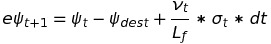
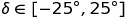
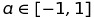
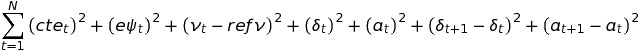

# CarND-MPC
Model Predictive Control from Self Driving Car Nanodegree of Udacity

Source code: 

# Reflection
## The model 
We consider the following Model Predictive Control model: 













The actuators are: 





The cost function is:




## Timestep Length and Elapsed Duration (N & dt)
I started with the following pair of values N = 25 and dt = 0.05. These values are based on the following code provided in the lesson 19, Model Predictive Control: 

[https://github.com/udacity/CarND-MPC-Quizzes/blob/master/mpc_to_line/solution/MPC.cpp](https://github.com/udacity/CarND-MPC-Quizzes/blob/master/mpc_to_line/solution/MPC.cpp)

In this moment we don't consider latency. I think the combination of values N=25 and dt = 0.05 is good. The result of this, is shown in the video below: 

[https://www.youtube.com/watch?v=Pgh-WwLoA_w&feature=youtu.be](https://www.youtube.com/watch?v=Pgh-WwLoA_w&feature=youtu.be)


I noticed that sometimes the vehicle would likely steer off the road and possibly crash. It would be very unpleasant to take a ride in this car, would't it? In order to fix this we tune the part of the cost function affecting steering: 


```cpp
 
 // Minimize the value gap between sequential actuations.
for (int t = 0; t < N - 2; t++) {
   fg[0] += CppAD::pow(vars[delta_start + t + 1] - vars[delta_start + t], 2);
   fg[0] += 100*CppAD::pow(vars[a_start + t + 1] - vars[a_start + t], 2);
}
```

The result of this, is shown in the video below: 

[https://www.youtube.com/watch?v=TQxROUeTm9Y&feature=youtu.be](https://www.youtube.com/watch?v=Pgh-WwLoA_w&feature=youtu.be)

The car's behaviour looks better. 


## Polynomial Fitting and MPC Preprocessing 

We use a polynomial degree of order 3. In order to transform the waypoints to the car's coordinate system (the server returns waypoints using the map's coordinate system). 


